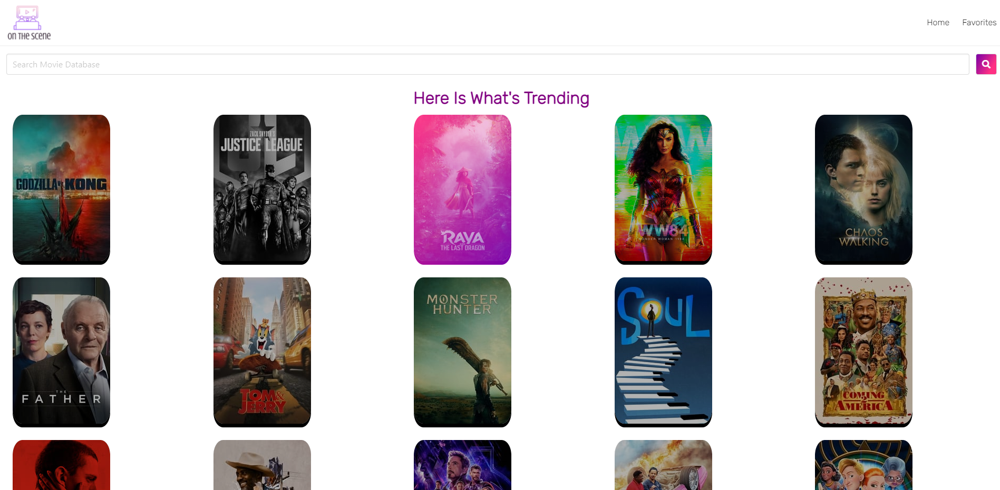

# On The Scene Movie App 

## Description

On The Scene is a Movie Database that provides streaming availability details for Movies and Television Shows.

## Table of Contents

  - [Description](#description)
  - [Table of Contents](#table-of-contents)
  - [Live Link](#live-link)
  - [Usage](#usage)
  - [Contributions](#contributions)
  - [Questions](#questions)

## Live Link

Here is a link to the live application: [https://rkurian97.github.io/bc-project-1/](https://rkurian97.github.io/bc-project-1/)

## Usage

[Movie Database API](https://rapidapi.com/rapidapi/api/movie-database-imdb-alternative)

[OMDb API](http://www.omdbapi.com/)

## Contributions

[Rohith Kurian](https://github.com/rkurian97)

[Sharee Osbourne](https://github.com/ShareeO)

[Dakota Nelson](https://github.com/kotalilyy)

##

## Questions

If you have any questions feel free to email the contributing team members.

Rohith Kurian  

Sharee Osbourne  

Dakota Nelson 